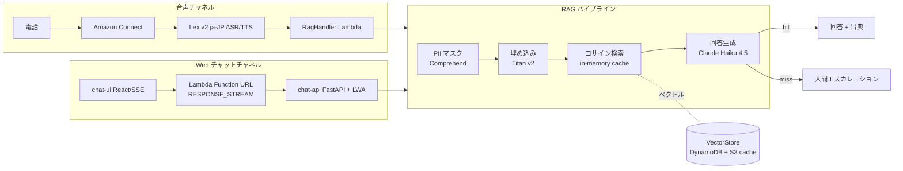

# au じぶん銀行 AI エージェント

Amazon Connect ベースの**日本語音声 RAG カスタマーサポート**と、その**顧客向け Web チャット版**。
電話・チャットの問い合わせを、じぶん銀行の公開情報（~130,000 チャンク）に基づき
Claude が回答し、答えられない場合は人間オペレーターへエスカレーションします。

> このリポジトリは AI-DLC（AI-Driven Development Life Cycle）ワークフローで構築した
> 実装です。本ファイルはプロジェクト（成果物）の概要、ルート `README.md` は AI-DLC
> フレームワーク自体の説明です。

## アーキテクチャ



**2 つの入口（音声・Web）が同一の RAG パイプラインを共有**します。音声は Connect の
8 秒制約に合わせて 6 秒バジェットで動き、Web はストリーミングでトークンを逐次返します。

## スタック構成（CDK / ap-northeast-1）

- **U-01 SharedInfra** — KMS, DynamoDB×5, S3, Connect, **Lex v2**, Lambda Layer
- **U-02 KnowledgePipeline** — Crawler + Embedder, EventBridge
- **U-03 Conversation** — **RagHandler**, Personalizer, Escalation, CSAT
- **U-04 Omnichannel** — ChannelSwitch, AI Contact Flow
- **U-05 Profile** — CustomerProfile, CrmWriter
- **U-06 Improvement** — ContactLens 分析, GapAnalyzer, SuggestionGenerator
- **U-07 Dashboard** — Metrics/Suggestion API, Cognito, React ダッシュボード
- **U-08 Chat** — **chat-api（FastAPI + Lambda Web Adapter, Function URL streaming）**

## エンジニアリングの見どころ

- **音声経路の Lex ビルド問題を解決** — `ja_JP` ロケールが `FallbackIntent` のみでビルド
  不能だった問題に、カスタムインテントを追加。さらに `AWS::Lex::BotVersion` の
  イミュータブル性でエイリアスが古い失敗バージョンを指す問題を、**BotVersion の論理 ID を
  定義ハッシュ化**して解決（変更時に新バージョンを強制生成）。
- **検索レイテンシ最適化** — S3 ベクトルキャッシュの in-memory 化と float32 統一で、
  ウォーム検索を ~1,800ms → ~550ms に短縮。
- **ストリーミング Web チャット** — Python で Lambda レスポンスストリーミングを実現する
  ため **Lambda Web Adapter + FastAPI** を採用し、既存 RAG パイプライン（Python）を
  そのまま再利用。Function URL `RESPONSE_STREAM` でトークンを逐次配信し、**体感 TTFT を
  約1.5秒**に。
- **ベクトルキャッシュ整合性の修正** — matrix.npy と meta.json が別オブジェクトで
  非アトミックに書かれ、インクリメンタル更新の stale-index バグと並行実行で行数が
  ドリフト（129,861 vs 129,863）し RAG 全体が空回答に。**index 再構築・書き込み前の
  整合性ガード・Embedder の直列化**で恒久修正。
- **コスト最適化** — 未使用 NAT Gateway 削除、着信不可の海外トールフリー番号の整理。

## 評価結果（dev, 2026-06-28）

`scripts/rag_eval` を 15 問で実行:

- **回答ヒット率**: **100%** (14/14)
- **ソース根拠率**: **100%**（全回答に jibunbank.co.jp 出典）
- **ハルシネーション制御**: **100%**（無意味な入力を正しく拒否）
- **TTFT（ウォーム中央値）**: **~1.5 秒**
- **総時間（中央値）**: ~4.2 秒

## デモ

実電話番号なしで、Web チャットまたは各層の直接呼び出しで動作確認できます。

```bash
# 1. chat-api の Function URL とデモキーを取得
aws cloudformation describe-stacks --stack-name AuJibunBank-dev-Chat \
  --query 'Stacks[0].Outputs' --region ap-northeast-1
KEY=$(aws secretsmanager get-secret-value \
  --secret-id au-jibun-bank-dev-chat-demo-key --query SecretString --output text)

# 2. ストリーミングを curl で確認
curl -sN -X POST "<ChatApiUrl>/chat" \
  -H "content-type: application/json" -H "x-demo-key: $KEY" \
  -d '{"message":"住宅ローンの金利について教えてください"}'

# 3. チャット UI をローカル起動
cd chat-ui && npm install && cp .env.example .env.local   # 値を設定
npm run dev   # http://localhost:5174
```

## 技術スタック

AWS CDK (TypeScript) · Python 3.12 · FastAPI · Lambda Web Adapter · Amazon Connect ·
Lex v2 · Amazon Bedrock (Claude Haiku 4.5 / Titan Embeddings v2) · Comprehend ·
DynamoDB · S3 · React + Vite · uv · GitHub Actions (OIDC)
