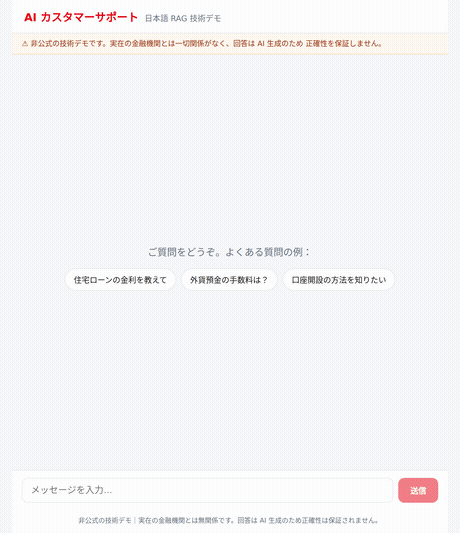
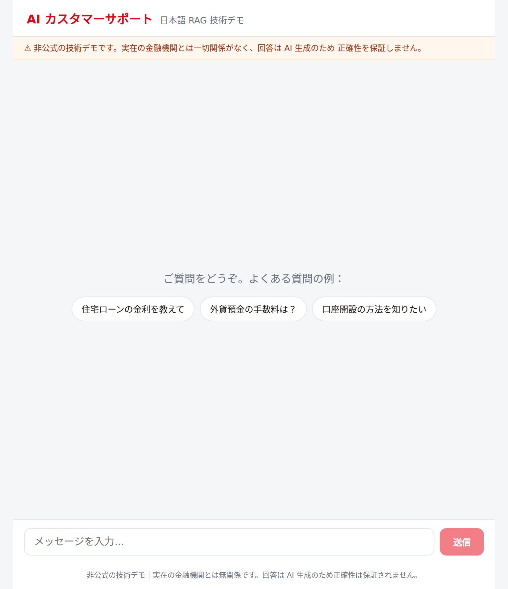
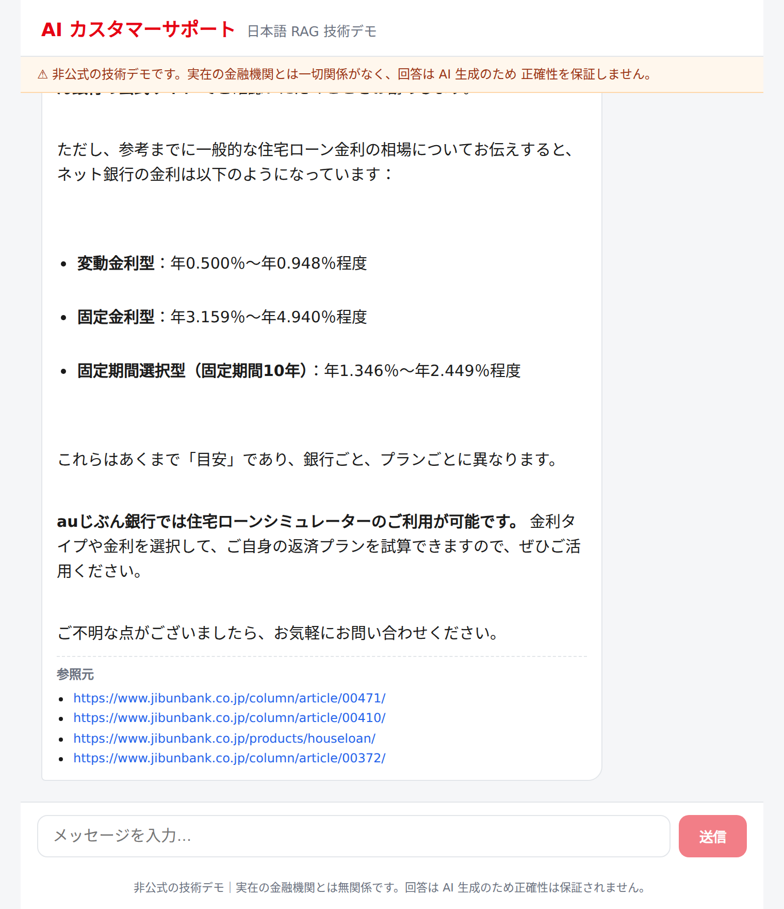
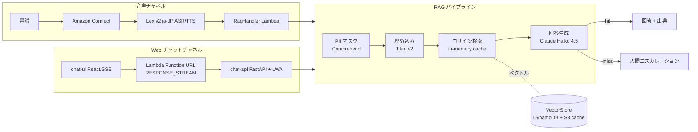

# 日本語音声 RAG カスタマーサポート AI エージェント（技術デモ）

Amazon Connect ベースの**日本語音声 RAG カスタマーサポート**と、その**顧客向け Web チャット版**。
電話・チャットの問い合わせを、公開ウェブ情報（~130,000 チャンク）に基づき Claude が回答し、
答えられない場合は人間オペレーターへエスカレーションします。

> ## ⚠️ 免責事項 / Disclaimer
>
> 本リポジトリは **個人が技術検証目的で作成した非公式のデモ**です。
> 題材として実在金融機関のサービス名・公開ウェブ情報を参照していますが、
> **「au じぶん銀行」および KDDI / auフィナンシャルグループとは一切関係がなく、
> 同行が許諾・推奨・関与するものではありません。** 各種名称・ロゴ等は各権利者の商標です。
> 取り込んだ公開情報は**非営利の技術デモ目的のみ**で使用しており、回答は AI 生成のため
> 正確性を保証しません。実際の商品情報は各社公式サイトをご確認ください。
>
> This is an **independent, unofficial technical demo / portfolio project**. It is
> **not affiliated with, authorized, or endorsed by au Jibun Bank or KDDI**. All
> names and marks belong to their respective owners; public content is used only
> for a non-commercial demonstration and AI-generated answers may be inaccurate.

_補足: このリポジトリは AI-DLC（AI-Driven Development Life Cycle）ワークフローで構築した
実装です。本ファイルはプロジェクト（成果物）の概要、ルート `README.md` は AI-DLC
フレームワーク自体の説明です。_

## デモ（Web チャット）



質問を送ると、回答が**トークン単位でストリーミング表示**され、末尾に**参照元**
（じぶん銀行公式ページ）が付きます。

- 初期状態（質問例チップ）: 
- 回答＋参照元: 

## アーキテクチャ



**2 つの入口（音声・Web）が同一の RAG パイプラインを共有**します。音声は Connect の
8 秒制約に合わせて 6 秒バジェットで動き、Web はストリーミングでトークンを逐次返します。

## スタック構成（CDK / ap-northeast-1）

- **U-01 SharedInfra** — KMS, DynamoDB×5, S3, Connect, **Lex v2**, Lambda Layer
- **U-02 KnowledgePipeline** — Crawler + Embedder, EventBridge
- **U-03 Conversation** — **RagHandler**, Personalizer, Escalation, CSAT
- **U-04 Omnichannel** — ChannelSwitch, AI Contact Flow
- **U-05 Profile** — CustomerProfile, CrmWriter
- **U-06 Improvement** — ContactLens 分析, GapAnalyzer, SuggestionGenerator
- **U-07 Dashboard** — Metrics/Suggestion API, Cognito, React ダッシュボード
- **U-08 Chat** — **chat-api（FastAPI + Lambda Web Adapter, Function URL streaming）**

## エンジニアリングの見どころ

- **音声経路の Lex ビルド問題を解決** — `ja_JP` ロケールが `FallbackIntent` のみでビルド
  不能だった問題に、カスタムインテントを追加。さらに `AWS::Lex::BotVersion` の
  イミュータブル性でエイリアスが古い失敗バージョンを指す問題を、**BotVersion の論理 ID を
  定義ハッシュ化**して解決（変更時に新バージョンを強制生成）。
- **検索レイテンシ最適化** — S3 ベクトルキャッシュの in-memory 化と float32 統一で、
  ウォーム検索を ~1,800ms → ~550ms に短縮。
- **ストリーミング Web チャット** — Python で Lambda レスポンスストリーミングを実現する
  ため **Lambda Web Adapter + FastAPI** を採用し、既存 RAG パイプライン（Python）を
  そのまま再利用。Function URL `RESPONSE_STREAM` でトークンを逐次配信し、**体感 TTFT を
  約1.5秒**に。
- **ベクトルキャッシュ整合性の修正** — matrix.npy と meta.json が別オブジェクトで
  非アトミックに書かれ、インクリメンタル更新の stale-index バグと並行実行で行数が
  ドリフト（129,861 vs 129,863）し RAG 全体が空回答に。**index 再構築・書き込み前の
  整合性ガード・Embedder の直列化**で恒久修正。
- **コスト最適化** — 未使用 NAT Gateway 削除、着信不可の海外トールフリー番号の整理。

## 評価結果（dev, 2026-06-29）

回答品質は「根拠つき回答を返したか」だけでなく、**LLM-as-judge（Claude Sonnet）**で
検索文脈に対する**忠実性（ハルシネーションの無さ）**と**有用性（実際に役立つか）**を
1–5 で採点（`scripts/rag_eval/judge_eval.py`, 14 問）。

検索診断（`inspect_retrieval.py`）で「無関係な文脈が低スコアで混入し誤対応付け／捏造を
誘発」していると分かり、**検索閾値（0.30→0.40）とプロンプト**を調整して再計測:

- 忠実性: 4.14 → **4.71 / 5**
- 有用性: 3.79 → **3.57 / 5**（捏造を減らした分、情報不足時は安全に hedge）
- 「的確」(忠実性≥4 かつ 有用性≥4): 57% → **71%**
- **ハルシネーション: 3 件 → 0 件**

レイテンシ（ストリーミング, `evaluate.py`）: **ウォーム TTFT 中央値 ~1.5 秒** / 総時間 ~4.2 秒。

**正直な限界**: 残り 29% は捏造ではなく**コーパス欠落**（例: 振込手数料・デビット還元・
現在の定期金利）で、システムは無理に答えず「お答えしかねます」と退避する。これは静的
クローラーが動的描画／表組みの数値を取り切れないためで、次の改善は headless クロール。

## デモ

実電話番号なしで、Web チャットまたは各層の直接呼び出しで動作確認できます。

```bash
# 1. chat-api の Function URL とデモキーを取得
aws cloudformation describe-stacks --stack-name AuJibunBank-dev-Chat \
  --query 'Stacks[0].Outputs' --region ap-northeast-1
KEY=$(aws secretsmanager get-secret-value \
  --secret-id au-jibun-bank-dev-chat-demo-key --query SecretString --output text)

# 2. ストリーミングを curl で確認
curl -sN -X POST "<ChatApiUrl>/chat" \
  -H "content-type: application/json" -H "x-demo-key: $KEY" \
  -d '{"message":"住宅ローンの金利について教えてください"}'

# 3. チャット UI をローカル起動
cd chat-ui && npm install && cp .env.example .env.local   # 値を設定
npm run dev   # http://localhost:5174
```

## 技術スタック

AWS CDK (TypeScript) · Python 3.12 · FastAPI · Lambda Web Adapter · Amazon Connect ·
Lex v2 · Amazon Bedrock (Claude Haiku 4.5 / Titan Embeddings v2) · Comprehend ·
DynamoDB · S3 · React + Vite · uv · GitHub Actions (OIDC)
