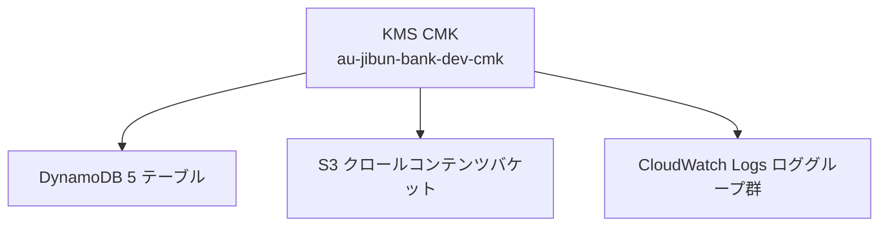
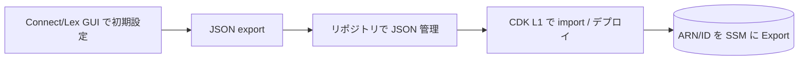

# U-01 Core Infrastructure — Business Logic Model
# （インフラリソース設計ロジック）

> U-01 はアプリケーションのビジネスロジックを持たない純粋インフラユニットである。
> 本ドキュメントの「ビジネスロジック」は **インフラリソースの設計判断ロジック** を意味する。

---

## 1. DynamoDB テーブル設計ロジック

### 1.1 なぜテーブルを 5 つに分割したか（Single-Table vs Multi-Table）

完全な Single-Table 設計（1 テーブル集約）ではなく、ドメイン境界に沿った **5 テーブル分割 + 一部 Single-Table 的な複合キー** を採用した。

| テーブル | 設計タイプ | 判断根拠 |
| --- | --- | --- |
| VectorStore | シンプルキー（PK=chunkId） | RAG 検索で全件 scan するため独立テーブルが有利。embedding バイナリで行サイズが大きく、他ドメインと混在させると scan コストが悪化する。 |
| CustomerHistory | Single-Table 的（PK=customerId, SK=sk） | TURN/SUMMARY/CSAT/SESSION を 1 顧客の下に束ね、`customerId` への単一クエリで会話文脈を一括取得できる。 |
| ImprovementSuggestions | シンプルキー + 複数 GSI | 改善提案は status/week での絞り込みが主軸。GSI で運用ビューを提供。 |
| ContentDiff | シンプルキー（PK=chunkId） | 差分検出の基準状態。VectorStore と PK が同じ chunkId だが、ライフサイクル（差分基準 vs 検索対象）が異なるため分離。 |
| ContactAnalysis | 複合キー（PK=weekStart, SK=contactId） | 週次バッチ単位で生成・参照する中間データ。週でパーティション分割するのが自然。 |

**結論**: 各ドメインで TTL・アクセスパターン・行サイズが大きく異なるため、ドメイン分割が運用・コスト両面で最適。1 顧客内の多種別アイテムは Single-Table 的に複合キーで束ねる。

### 1.2 なぜ On-Demand キャパシティか

- 想定トラフィック: 月 100 セッション未満（極低負荷）。
- プロビジョンド容量はアイドル時もコストが発生する。On-Demand は「リクエスト課金」でアイドルコストゼロ。
- スパイク（週次バッチ・自己改善サイクル）にも自動スケールで追従。
- 月額コスト目標 ≤ 5,000 円（見積 ~3,266 円）に対し、On-Demand が最小コスト構成。

### 1.3 GSI 設計ロジック

| テーブル | GSI | キー | 用途 |
| --- | --- | --- | --- |
| VectorStore | gsi_sourceUrl | PK=sourceUrl | URL 単位でチャンクを一括削除（クロール差分反映） |
| CustomerHistory | gsi_contactId | PK=contactId, SK=sk | チャネル切替時にコンタクト単位で文脈参照 |
| ImprovementSuggestions | gsi_status | PK=status, SK=priorityScore | 承認ステータス別 + 優先度順の取得 |
| ImprovementSuggestions | gsi_week | PK=weekStart | 週次レポート抽出 |
| ContentDiff | gsi_sourceUrl | PK=sourceUrl | URL 単位の差分判定 |
| ContactAnalysis | （なし） | — | PK(weekStart)+SK(contactId) で参照パターン充足 |

**原則**: GSI は実在するアクセスパターンに対してのみ作成（投機的 GSI を作らない）。GSI 追加はコスト・書込増幅を伴うため最小化。

### 1.4 embedding を Binary 型で格納する理由

- 1024 次元の埋め込みベクトルを `List<Number>` で格納すると DynamoDB の属性オーバーヘッドが大きく、行サイズ・RCU が膨らむ。
- Binary（B）型で連続バイト列として格納し、アプリ側で numpy 等にデコードする方がストレージ効率・scan 性能とも有利。

### 1.5 TTL 設計ロジック

| テーブル | TTL | 理由 |
| --- | --- | --- |
| CustomerHistory | `expiresAt` 90 日 | 会話履歴は 90 日で自動失効（プライバシー・コスト） |
| VectorStore / ContentDiff | なし | 差分管理で明示削除（TTL で消えると検索基準が壊れる） |
| ImprovementSuggestions | なし | 改善提案は永続（監査・承認履歴） |
| ContactAnalysis | なし | 週次データとして運用管理 |

---

## 2. SSM Parameter Store によるクロススタック参照パターン

### 2.1 なぜ CloudFormation Export ではなく SSM か

| 観点 | CloudFormation Export | SSM Parameter Store（採用） |
| --- | --- | --- |
| 結合度 | Export を参照中のスタックがあると Producer を変更/削除できない（硬直） | 疎結合。Consumer 側は実行時に値を取得 |
| 削除順序の制約 | 強い依存ロック | なし |
| 値の更新 | 困難 | パラメータ更新で柔軟 |
| 命名 | 論理名のみ | 階層パスで体系化可能 |

スタック間を疎結合に保ち、U-01 を独立してデプロイ・更新できるようにするため SSM を採用。

### 2.2 命名規則

```
/au-jibun-bank/{env}/{service}/{resource}
```

例:
- `/au-jibun-bank/dev/dynamodb/vector-store-table-name`
- `/au-jibun-bank/dev/kms/cmk-arn`
- `/au-jibun-bank/dev/s3/crawl-content-bucket-name`
- `/au-jibun-bank/dev/connect/instance-arn`
- `/au-jibun-bank/dev/lex/bot-id`

### 2.3 データフロー

```mermaid
flowchart LR
  subgraph U01[SharedInfraStack (U-01)]
    R[DynamoDB / KMS / S3 / Connect / Lex / Secrets]
  end
  U01 -->|Put Parameter| SSM[(SSM Parameter Store<br/>/au-jibun-bank/dev/...)]
  SSM -->|Get Parameter| U02[U-02 Crawler]
  SSM -->|Get Parameter| U03[U-03 Voice/Lex]
  SSM -->|Get Parameter| U05[U-05 CRM/History]
  SSM -->|Get Parameter| U07[U-07 Dashboard]
```

U-01 が唯一の Producer、後続が Consumer。U-01 は他ユニットに依存しない最上流スタック。

---

## 3. KMS CMK 設計（全テーブル・S3・Logs 共用）

### 3.1 単一 CMK 共用の理由

- リソースごとに CMK を分けると鍵数・キーポリシー管理・コストが増える。
- U-01 のスコープでは保護対象が同一信頼境界（同一アカウント・同一プロジェクト）にあるため、単一 CMK で十分。
- 自動年次ローテーション有効。将来、機微度別に鍵分割が必要になれば追加する設計余地を残す。

### 3.2 暗号化対象



AWS Managed Key ではなく CMK を選ぶ理由は、キーポリシーで「誰が暗号化/復号できるか」を明示制御し、IAM 最小権限・監査と整合させるため。

---

## 4. Connect / Lex IaC 管理方針（GUI → JSON import フロー）

Amazon Connect / Lex v2 は L2 Construct が未成熟なため、CDK L1 Construct（`aws-connect` / `aws-lex`）で **外枠のみ** を管理する。



- U-01: インスタンス・ボットの骨格（言語 ja-JP、ロケール枠）をデプロイし ARN/ID を Export。
- U-03: コンタクトフロー本体・Lex インテント詳細を実装（U-01 のスコープ外）。

---

## 5. AppError 例外階層の設計ロジック

`src/common/` に基底 `AppError` と派生を定義し、後続ユニットが一貫したエラー分類を使えるようにする。U-01 では型定義 + 単体テストのみ。

エラーは「ハンドリング戦略」で分類される:

| 分類 | 代表例外 | 戦略 |
| --- | --- | --- |
| リトライ（指数バックオフ） | `BedrockThrottledError` | 再試行 |
| リトライ後 DLQ | `CrmApiError` | 再試行→失敗で DLQ |
| フォールバック | `TimeoutBudgetExceeded`（8 秒制約） | 即フォールバック応答 |
| 即時失敗 | `ValidationError` / `UnauthorizedError` | 4xx 相当で返却 |

型階層により、catch 側が基底クラス（例: `BedrockError`）で一括捕捉も可能。
