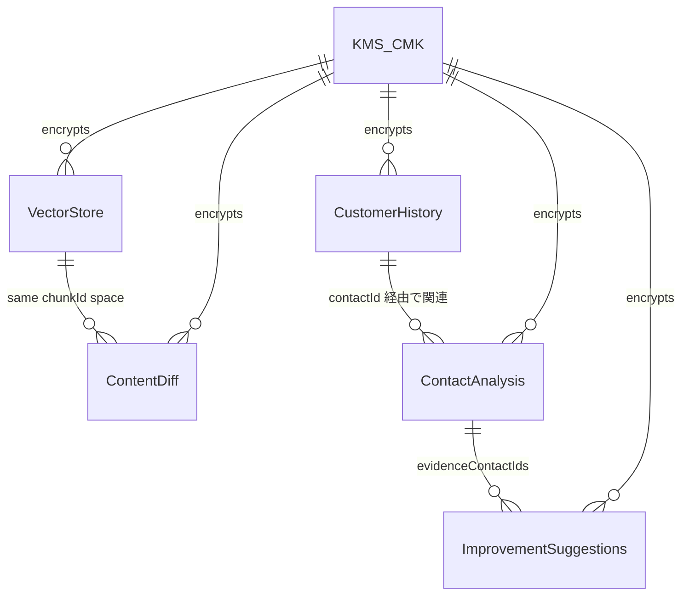
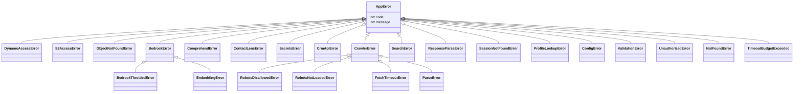

# U-01 Core Infrastructure — Domain Entities

# （インフラエンティティ定義）

U-01 が定義・管理するインフラエンティティと、後続ユニットが参照するインターフェース（SSM パラメータ）を確定する。

---

## 1. インフラエンティティ一覧

| エンティティ | 種別 | 暗号化 | 主な利用ユニット |
| --- | --- | --- | --- |
| VectorStore | DynamoDB テーブル | KMS CMK | U-02, U-03 |
| CustomerHistory | DynamoDB テーブル | KMS CMK | U-03, U-05 |
| ImprovementSuggestions | DynamoDB テーブル | KMS CMK | U-06, U-07 |
| ContentDiff | DynamoDB テーブル | KMS CMK | U-02 |
| ContactAnalysis | DynamoDB テーブル | KMS CMK | U-06, U-07 |
| crawl-content バケット | S3 バケット | SSE-KMS | U-02 |
| au-jibun-bank-dev-cmk | KMS CMK | — | 全テーブル/S3/Logs |
| crm-api-key | Secrets Manager シークレット | KMS | U-05 |
| Lambda ロググループ群 | CloudWatch Logs | KMS CMK | 全 Lambda ユニット |
| Connect インスタンス | Amazon Connect | — | U-03 |
| Lex v2 ボット | Lex v2 | — | U-03 |
| Lambda 実行ロール群 + 権限境界 | IAM | — | U-02〜U-07 |
| SSM パラメータ群 | SSM Parameter Store | — | 全後続ユニット |
| AppError 例外階層 | Python（src/common/） | — | 全 Lambda ユニット |

---

## 2. DynamoDB テーブルエンティティ図

### 2.1 VectorStore

```
PK: chunkId (S)
SK: なし
属性: embedding(B 1024dim), text(S), sourceUrl(S), contentHash(S), lang(S), crawledAt(S ISO8601)
TTL: なし
GSI: gsi_sourceUrl (PK=sourceUrl)
アクセス: EmbedderLambda(upsert/delete), RagHandler/CosineSimilaritySearcher(scan_all)
```

### 2.2 CustomerHistory

```
PK: customerId (S)
SK: sk (S)  — TURN#<ts> / SUMMARY#<contactId> / CSAT#<contactId> / SESSION#<contactId>
属性: role(S), text(S PIIマスク済), timestamp(S), contactId(S), channel(S), csatScore(N), summary(S)
TTL: expiresAt (N epoch) 90日
GSI: gsi_contactId (PK=contactId, SK=sk)
```

### 2.3 ImprovementSuggestions

```
PK: suggestionId (S)
SK: なし
属性: weekStart(S), targetUrl(S), suggestion(S), priorityScore(N),
      status(S: pending/approved/rejected/held), createdAt(S), evidenceContactIds(L)
TTL: なし（永続）
GSI: gsi_status (PK=status, SK=priorityScore), gsi_week (PK=weekStart)
```

### 2.4 ContentDiff

```
PK: chunkId (S)
SK: なし
属性: contentHash(S), sourceUrl(S), s3Key(S), lastSeenAt(S ISO8601)
TTL: なし
GSI: gsi_sourceUrl (PK=sourceUrl)
```

### 2.5 ContactAnalysis

```
PK: weekStart (S)
SK: contactId (S)
属性: csatScore(N), escalated(BOOL), transcriptSummary(S PIIマスク済),
      gapCategory(S), confusionScore(N), analyzedAt(S)
TTL: なし
GSI: なし
```

### 2.6 ER 概観（論理）



---

## 3. SSM パラメータ一覧（後続ユニット参照インターフェース）

| パラメータ名 | 型 | 値 | 参照ユニット |
| --- | --- | --- | --- |
| `/au-jibun-bank/dev/dynamodb/vector-store-table-name` | String | テーブル名 | U-02, U-03 |
| `/au-jibun-bank/dev/dynamodb/customer-history-table-name` | String | テーブル名 | U-03, U-05 |
| `/au-jibun-bank/dev/dynamodb/improvement-suggestions-table-name` | String | テーブル名 | U-06, U-07 |
| `/au-jibun-bank/dev/dynamodb/content-diff-table-name` | String | テーブル名 | U-02 |
| `/au-jibun-bank/dev/dynamodb/contact-analysis-table-name` | String | テーブル名 | U-06, U-07 |
| `/au-jibun-bank/dev/kms/cmk-arn` | String | CMK ARN | 全ユニット |
| `/au-jibun-bank/dev/kms/cmk-id` | String | CMK Key ID | 全ユニット |
| `/au-jibun-bank/dev/s3/crawl-content-bucket-name` | String | バケット名 | U-02 |
| `/au-jibun-bank/dev/secrets/crm-api-key-arn` | String | シークレット ARN | U-05 |
| `/au-jibun-bank/dev/connect/instance-arn` | String | Connect ARN | U-03 |
| `/au-jibun-bank/dev/connect/instance-id` | String | Connect ID | U-03 |
| `/au-jibun-bank/dev/lex/bot-id` | String | Lex ボット ID | U-03 |
| `/au-jibun-bank/dev/lex/bot-alias-arn` | String | Lex エイリアス ARN | U-03 |
| `/au-jibun-bank/dev/iam/lambda-permission-boundary-arn` | String | 権限境界 ARN | U-02〜U-07 |

---

## 4. Connect / Lex リソーススキーマ

### 4.1 Connect インスタンス

```yaml
ConnectInstance:
  IdentityManagementType: CONNECT_MANAGED   # GUI 初期設定後 JSON import
  InstanceAlias: au-jibun-bank-dev-connect
  Attributes:
    InboundCalls: true
    OutboundCalls: false
    ContactflowLogs: true
  exports:
    - /au-jibun-bank/dev/connect/instance-arn
    - /au-jibun-bank/dev/connect/instance-id
```

### 4.2 Lex v2 ボット（外枠）

```yaml
LexBot:
  Name: au-jibun-bank-dev-bot
  DataPrivacy: { ChildDirected: false }
  IdleSessionTTLInSeconds: 300
  RoleArn: <lex-service-role-arn>
  BotLocales:
    - LocaleId: ja-JP            # 日本語
      NluConfidenceThreshold: 0.4
      # インテント詳細は U-03 が追加（U-01 は骨格のみ）
  exports:
    - /au-jibun-bank/dev/lex/bot-id
    - /au-jibun-bank/dev/lex/bot-alias-arn
```

---

## 5. AppError 例外エンティティ（src/common/）



U-01 では上記の型定義 + 単体テスト（`tests/unit/common/`）のみ提供。実利用は後続ユニット。
