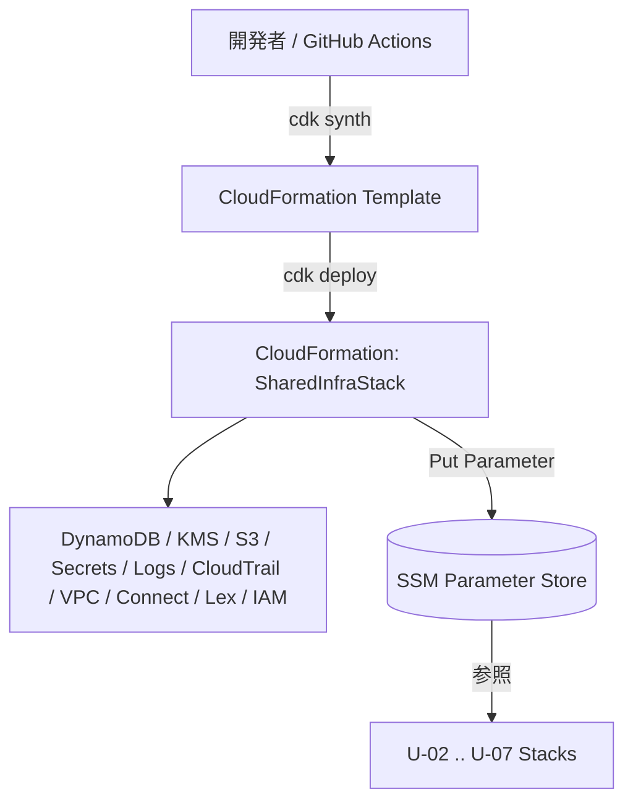
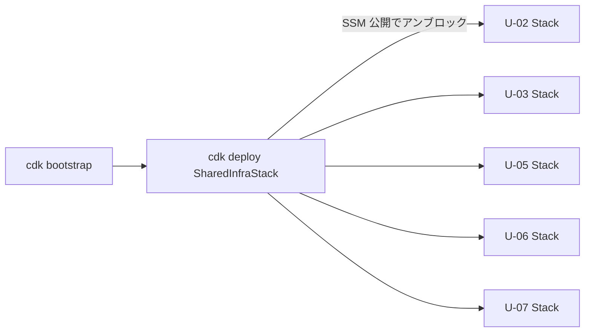

# U-01 Core Infrastructure — Deployment Architecture

`SharedInfraStack` のデプロイ方式・順序・CI/CD・ロールバック・命名規則を定義する。

---

## 1. CDK デプロイアーキテクチャ



- U-01 はどのユニットにも依存しない最上流スタック。
- 出力は SSM パラメータのみ（CloudFormation Export 不使用）。

---

## 2. 環境別設定（dev / staging / prod）

| 環境 | リソース名サフィックス | SSM パス | RemovalPolicy |
| --- | --- | --- | --- |
| dev | `-dev-` | `/au-jibun-bank/dev/...` | DESTROY 可（検証用） |
| staging | `-staging-` | `/au-jibun-bank/staging/...` | RETAIN |
| prod | `-prod-` | `/au-jibun-bank/prod/...` | RETAIN |

- CDK Context または環境変数 `ENV` で分岐。リソース名・SSM パスに `{env}` を埋め込み。
- U-01 はまず dev に deploy（DoD: dev 環境で全テーブル cdk deploy 成功）。

---

## 3. CDK Bootstrap 手順

```bash
# 初回のみ（アカウント × リージョンごと）
cdk bootstrap aws://<ACCOUNT_ID>/ap-northeast-1
```

- CDK アセット用 S3 / ECR / IAM を作成。dev/staging/prod それぞれのアカウントで実施。

---

## 4. デプロイ順序



1. `cdk bootstrap`（初回）。
2. `cdk deploy SharedInfraStack`（U-01 単独）。
3. SSM パラメータ公開後、後続スタックが参照可能になる（アンブロック）。

---

## 5. GitHub Actions CI/CD ワークフロー概要（U-01）

```yaml
name: u-01-shared-infra
on: { push: { paths: ['infra/**', 'src/common/**'] } }
jobs:
  ci:
    steps:
      - uses: actions/checkout@v4
      - run: uv sync                       # Python 依存解決
      - run: uv run ruff check .           # Lint
      - run: uv run mypy src tests         # 型チェック
      - run: uv run pytest tests/unit/common  # AppError 単体テスト
      - run: npm ci && npx cdk synth       # CDK synth
  deploy:
    needs: ci
    if: github.ref == 'refs/heads/main'
    steps:
      - run: npx cdk diff SharedInfraStack
      - run: npx cdk deploy SharedInfraStack --require-approval never
```

- ゲート: ruff + mypy + pytest + cdk synth を全通過後に deploy。

---

## 6. ロールバック戦略

- スタック更新失敗時は **CloudFormation 自動ロールバック**（前回安定状態へ復帰）。
- 手動 `cdk destroy` は運用では使用しない（共有基盤の誤削除防止、prod/staging は RETAIN）。
- データ復旧は DynamoDB PITR / S3 バージョニングで対応。

---

## 7. リソース命名規則

```
au-jibun-bank-{env}-{resource}-{suffix}
```

- 例: `au-jibun-bank-dev-vector-store`、`au-jibun-bank-dev-crawl-content-<account>`（S3 はグローバル一意化）。
- Connect/Lex: `au-jibun-bank-{env}-connect` / `au-jibun-bank-{env}-bot`。
- SSM: `/au-jibun-bank/{env}/{service}/{resource}`。
- 必須タグ: `Project=au-jibun-bank`, `Env={env}`, `Unit=U-01`, `ManagedBy=cdk`。

---

## 8. DoD チェック（デプロイ観点）

| DoD | 確認方法 |
| --- | --- |
| 5 テーブル cdk deploy 成功（dev） | `cdk deploy SharedInfraStack` 成功 + スタック CREATE_COMPLETE |
| Security Extension 全ルール（ブロッキング 0） | checkov / cdk-nag 等で 0 件 |
| DynamoDB/S3/Logs が KMS 暗号化 | 単体/統合テストで encryptionKey 検証 |
| Connect/Lex 骨格デプロイ + ARN/ID Export | SSM パラメータ存在確認 |
| AppError 階層 + 単体テスト合格 | `pytest tests/unit/common` green |
