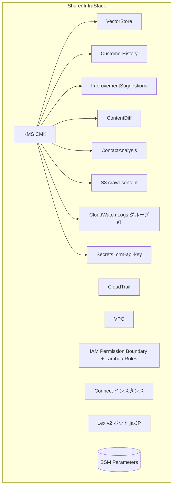

# U-01 Core Infrastructure — Infrastructure Design

# SharedInfraStack（`infra/stacks/shared_infra_stack.py` 相当 / CDK v2 TypeScript）

リージョン: ap-northeast-1。本ドキュメントは全リソースの CDK 設計を定義する。
CDK コードは TypeScript（`infra/stacks/`）、Lambda コードは Python 3.12。

---

## 1. SharedInfraStack 全リソース概観



---

## 2. DynamoDB 5 テーブル（CDK 設計）

共通設定: `billingMode: PAY_PER_REQUEST`（On-Demand）、`encryption: CUSTOMER_MANAGED`（共用 CMK）、`pointInTimeRecovery: true`、`removalPolicy: RETAIN`（dev は DESTROY 可）。

```typescript
// 例: VectorStore
const vectorStore = new dynamodb.Table(this, 'VectorStore', {
  tableName: `au-jibun-bank-${env}-vector-store`,
  partitionKey: { name: 'chunkId', type: dynamodb.AttributeType.STRING },
  billingMode: dynamodb.BillingMode.PAY_PER_REQUEST,
  encryption: dynamodb.TableEncryption.CUSTOMER_MANAGED,
  encryptionKey: cmk,
  pointInTimeRecovery: true,
});
vectorStore.addGlobalSecondaryIndex({
  indexName: 'gsi_sourceUrl',
  partitionKey: { name: 'sourceUrl', type: dynamodb.AttributeType.STRING },
});
```

| テーブル | PK | SK | TTL | GSI |
| --- | --- | --- | --- | --- |
| VectorStore | chunkId (S) | — | なし | gsi_sourceUrl(sourceUrl) |
| CustomerHistory | customerId (S) | sk (S) | expiresAt(90日) | gsi_contactId(contactId, sk) |
| ImprovementSuggestions | suggestionId (S) | — | なし | gsi_status(status, priorityScore), gsi_week(weekStart) |
| ContentDiff | chunkId (S) | — | なし | gsi_sourceUrl(sourceUrl) |
| ContactAnalysis | weekStart (S) | contactId (S) | なし | なし |

- CustomerHistory は `timeToLiveAttribute: 'expiresAt'` を設定。
- embedding は Binary 型で格納（アプリ側仕様、テーブル定義はスキーマレス）。

---

## 3. KMS CMK 定義

```typescript
const cmk = new kms.Key(this, 'SharedCmk', {
  alias: `alias/au-jibun-bank-${env}-cmk`,
  enableKeyRotation: true,            // 自動年次ローテーション
  removalPolicy: cdk.RemovalPolicy.RETAIN,
});
// keyPolicy: ルート + 限定ロールに encrypt/decrypt/GenerateDataKey を許可
cmk.grantEncryptDecrypt(lambdaExecutionRole);
```

- DynamoDB・S3・Logs・Secrets を単一 CMK で暗号化。
- ARN/ID を SSM に Export。

---

## 4. IAM Role / Policy 設計

```typescript
// 権限境界ポリシー（全 Lambda ロールの上限）
const permissionBoundary = new iam.ManagedPolicy(this, 'LambdaPermBoundary', { ... });

// 後続ユニット用 Lambda 実行ロール（プレースホルダー）
const lambdaRole = new iam.Role(this, 'SharedLambdaRole', {
  assumedBy: new iam.ServicePrincipal('lambda.amazonaws.com'),
  permissionsBoundary: permissionBoundary,
  managedPolicies: [/* AWSLambdaVPCAccessExecutionRole 等 */],
});
```

- 各ユニットは business-rules.md の最小権限境界に従いリソース別ポリシーを付与。
- `*` アクション/リソース禁止。KMS は必要操作のみ。

---

## 5. Secrets Manager 定義

```typescript
const crmApiKey = new secretsmanager.Secret(this, 'CrmApiKey', {
  secretName: `au-jibun-bank-${env}-crm-api-key`,
  encryptionKey: cmk,
  // 値はプレースホルダー。U-05 が GetSecretValue で参照
});
crmApiKey.grantRead(u05LambdaRole);   // U-05 のみ読取許可
```

---

## 6. S3 バケット定義（クロールコンテンツ用）

```typescript
const crawlBucket = new s3.Bucket(this, 'CrawlContent', {
  bucketName: `au-jibun-bank-${env}-crawl-content-${account}`,
  encryption: s3.BucketEncryption.KMS,
  encryptionKey: cmk,
  blockPublicAccess: s3.BlockPublicAccess.BLOCK_ALL,
  versioned: true,
  enforceSSL: true,                  // 非 TLS 拒否
  lifecycleRules: [{ noncurrentVersionExpiration: cdk.Duration.days(90) }],
});
```

- バケット名は SSM に格納（U-02 が参照）。

---

## 7. CloudWatch Logs ロググループ定義

```typescript
// Lambda 全関数用ロググループ（プレースホルダー命名）
new logs.LogGroup(this, 'AppLogGroup', {
  logGroupName: `/aws/lambda/au-jibun-bank-${env}`,
  retention: logs.RetentionDays.THREE_MONTHS,   // 90 日
  encryptionKey: cmk,
});
```

- 構造化 JSON ログ（AWS Lambda Powertools for Python）前提。
- PII 非出力。

---

## 8. CloudTrail 設定

```typescript
new cloudtrail.Trail(this, 'AuditTrail', {
  trailName: `au-jibun-bank-${env}-trail`,
  isMultiRegionTrail: true,
  enableFileValidation: true,
  encryptionKey: cmk,
  // 専用 S3 バケットへアーカイブ（TLS 必須・KMS 暗号化）
});
```

- 全リージョン・管理イベント + 必要なデータイベント（S3/DynamoDB）。

---

## 9. Connect インスタンス定義（CDK L1: aws-connect）

```typescript
const connectInstance = new connect.CfnInstance(this, 'ConnectInstance', {
  identityManagementType: 'CONNECT_MANAGED',
  instanceAlias: `au-jibun-bank-${env}-connect`,
  attributes: { inboundCalls: true, outboundCalls: false, contactflowLogs: true },
});
```

- GUI 初期設定後 JSON import フロー。ARN/ID を SSM に Export。

---

## 10. Lex v2 ボット定義（CDK L1: aws-lex、ja-JP）

```typescript
const lexBot = new lex.CfnBot(this, 'LexBot', {
  name: `au-jibun-bank-${env}-bot`,
  roleArn: lexServiceRole.roleArn,
  dataPrivacy: { childDirected: false },
  idleSessionTtlInSeconds: 300,
  botLocales: [{
    localeId: 'ja-JP',
    nluConfidenceThreshold: 0.4,
    // インテント詳細は U-03（U-01 は骨格のみ）
  }],
});
```

- ボット ID / エイリアス ARN を SSM に Export。

---

## 11. SSM Parameter Store 一覧（全 ARN/ID）

```typescript
new ssm.StringParameter(this, 'PVectorStoreName', {
  parameterName: `/au-jibun-bank/${env}/dynamodb/vector-store-table-name`,
  stringValue: vectorStore.tableName,
});
// 以下同様に全リソースを Put
```

| パラメータ名 | 値 |
| --- | --- |
| `/au-jibun-bank/{env}/dynamodb/vector-store-table-name` | VectorStore テーブル名 |
| `/au-jibun-bank/{env}/dynamodb/customer-history-table-name` | CustomerHistory テーブル名 |
| `/au-jibun-bank/{env}/dynamodb/improvement-suggestions-table-name` | ImprovementSuggestions テーブル名 |
| `/au-jibun-bank/{env}/dynamodb/content-diff-table-name` | ContentDiff テーブル名 |
| `/au-jibun-bank/{env}/dynamodb/contact-analysis-table-name` | ContactAnalysis テーブル名 |
| `/au-jibun-bank/{env}/kms/cmk-arn` | CMK ARN |
| `/au-jibun-bank/{env}/kms/cmk-id` | CMK Key ID |
| `/au-jibun-bank/{env}/s3/crawl-content-bucket-name` | S3 バケット名 |
| `/au-jibun-bank/{env}/secrets/crm-api-key-arn` | シークレット ARN |
| `/au-jibun-bank/{env}/connect/instance-arn` | Connect ARN |
| `/au-jibun-bank/{env}/connect/instance-id` | Connect ID |
| `/au-jibun-bank/{env}/lex/bot-id` | Lex ボット ID |
| `/au-jibun-bank/{env}/lex/bot-alias-arn` | Lex エイリアス ARN |
| `/au-jibun-bank/{env}/iam/lambda-permission-boundary-arn` | 権限境界 ARN |
