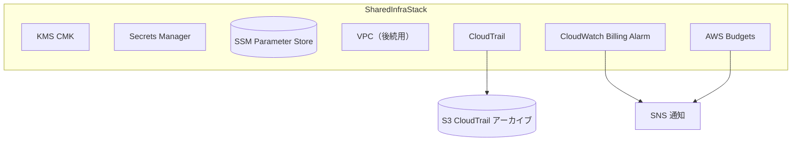

# U-01 Core Infrastructure — Logical Components

U-01 が論理的に管理する運用・横断コンポーネント。

---

## 1. コンポーネント一覧

---

## 2. CloudWatch Billing Alarm（月次コスト監視）
- メトリクス: `AWS/Billing EstimatedCharges`（us-east-1 で公開、通貨 USD 換算）。
- 閾値: 月次推定が約 4,000 円相当を超えたらアラーム。
- アクション: SNS トピックへ通知。
- 目的: 月額目標 5,000 円に対する早期警告。

## 3. CloudTrail（全 API 監査ログ）
- 全リージョン（multi-region trail）+ 管理イベント + データイベント（S3/DynamoDB 必要分）。
- ログは専用 S3 バケットにアーカイブ（KMS 暗号化、バケットポリシーで TLS 必須）。
- ログファイル検証（log file validation）有効。

## 4. AWS Budgets（月次予算アラート）
- 月次予算: 4,000 円。
- 実績/予測が閾値超過でメール通知（kats0813@gmail.com 等の運用窓口）。
- Billing Alarm と二重化し早期検知。

## 5. VPC（Lambda 配置用、後続で使用）
- U-01 で VPC・サブネット（プライベート）・ルート・VPC エンドポイント枠を定義。
- U-01 自身は Lambda を持たないため利用は U-02 以降。
- セキュリティ要件「Lambda は VPC 内配置」を満たす基盤を先行整備。

## 6. KMS CMK（単一キー・全リソース共用）
- DynamoDB 5 テーブル・S3・CloudWatch Logs を 1 本の CMK で暗号化。
- 自動年次ローテーション。
- キーポリシーで限定ロールのみ暗号化/復号許可。
- ARN/ID を SSM で共有。

## 7. Secrets Manager シークレット定義
- `crm-api-key`: CRM API キー（U-05 が `GetSecretValue` で参照）。
- KMS 暗号化。U-01 ではプレースホルダー作成（値は手動/別経路投入）。
- ARN を SSM `/au-jibun-bank/dev/secrets/crm-api-key-arn` で共有。

## 8. SSM Parameter Store パラメータ設計
- 命名: `/au-jibun-bank/{env}/{service}/{resource}`。
- 型: `String`（ARN/ID/名前）。機微値は格納しない。
- 階層により env / service ごとに一覧・権限制御が容易。

| 階層 | 用途 |
| --- | --- |
| `/au-jibun-bank/dev/dynamodb/*` | テーブル名 5 件 |
| `/au-jibun-bank/dev/kms/*` | CMK ARN/ID |
| `/au-jibun-bank/dev/s3/*` | バケット名 |
| `/au-jibun-bank/dev/secrets/*` | シークレット ARN |
| `/au-jibun-bank/dev/connect/*` | Connect ARN/ID |
| `/au-jibun-bank/dev/lex/*` | Lex ボット ID/エイリアス |
| `/au-jibun-bank/dev/iam/*` | 権限境界 ARN |
