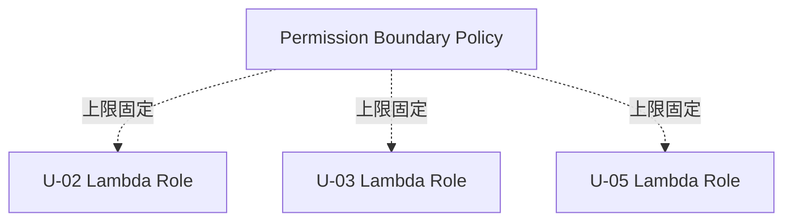
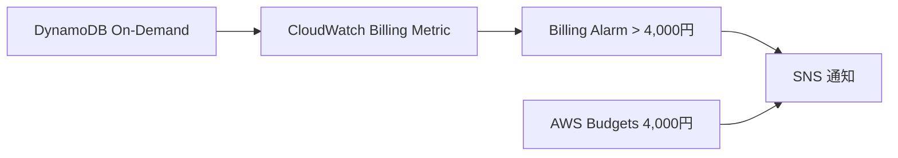
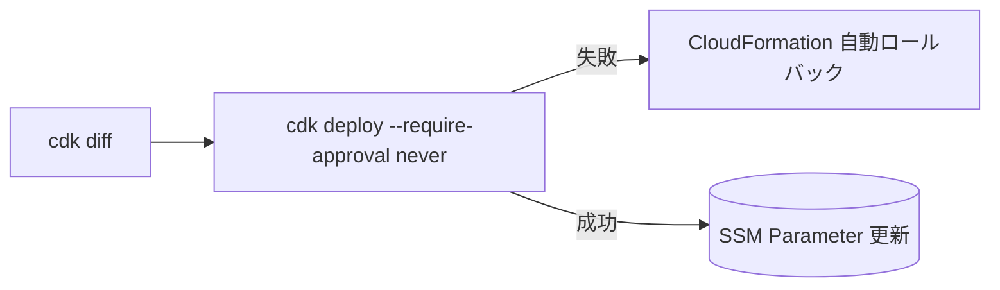
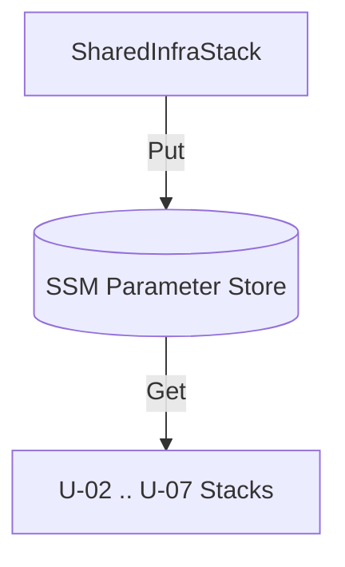

# U-01 Core Infrastructure — NFR Design Patterns

NFR を満たすための具体的な設計パターン。

---

## 1. セキュリティパターン

### 1.1 IAM Permission Boundary

- 全 Lambda 実行ロールに権限境界ポリシーを付与し、付与可能な権限の上限を固定。
- 後続ユニットがロールを拡張しても境界を超えられない（権限昇格防止）。
- 境界 ARN は SSM `/au-jibun-bank/dev/iam/lambda-permission-boundary-arn` で共有。



### 1.2 KMS CMK 自動ローテーション

- CMK は `enableKeyRotation: true`（自動年次ローテーション）。
- キーポリシーでルートアカウント + 限定ロールのみ暗号化/復号許可。

### 1.3 Secrets Manager 自動ローテーション（将来）

- CRM API キーはシークレットとして格納。U-01 ではプレースホルダー定義 + 手動投入。
- 将来、ローテーション Lambda を追加し自動ローテーション化（設計余地を残す）。

### 1.4 転送時暗号化

- S3 バケットポリシーで `aws:SecureTransport=false` を Deny（非 TLS 拒否）。
- 全 AWS API 呼び出しは TLS 1.2 以上。

---

## 2. コスト管理パターン



- DynamoDB On-Demand でアイドルコストゼロ。
- CloudWatch Billing Alarm: 月次推定 4,000 円超でアラーム（目標 5,000 円に対する早期警告）。
- AWS Budgets: 月次予算 4,000 円でメール通知。

---

## 3. 可観測性パターン

- **構造化 JSON ログ**: 全 Lambda で AWS Lambda Powertools for Python を採用。相関 ID・サービス名を自動付与。PII はフィールド単位で除外。
- **カスタムメトリクス**: CloudWatch カスタムネームスペース `AuJibunBank/Agent` を採用し、ユニット横断でメトリクスを集約。
- **保持期間**: ロググループ 90 日。CMK 暗号化。

```
Namespace: AuJibunBank/Agent
Dimensions: Unit, Env, Function
```

---

## 4. CDK デプロイパターン



- CI/CD では `cdk diff` で差分確認後 `cdk deploy --require-approval never`。
- ロールバックは CloudFormation 自動ロールバックに委譲。手動 `cdk destroy` は運用で使用しない。

---

## 5. クロススタック参照パターン

- SSM Parameter Store を単一の真実源とする。
- 命名: `/au-jibun-bank/{env}/{service}/{resource}`。
- Producer は U-01（`SharedInfraStack`）のみ。Consumer は U-02〜U-07。
- CloudFormation Export は使用しない（疎結合維持）。



---

## 6. レジリエンスパターン

| パターン | 適用 |
| --- | --- |
| DynamoDB PITR | 全テーブル有効（35 日連続復旧点） |
| S3 バージョニング | クロールコンテンツバケットで有効 |
| 自動ロールバック | CloudFormation スタック更新失敗時 |
| KMS ローテーション | 自動年次 |
