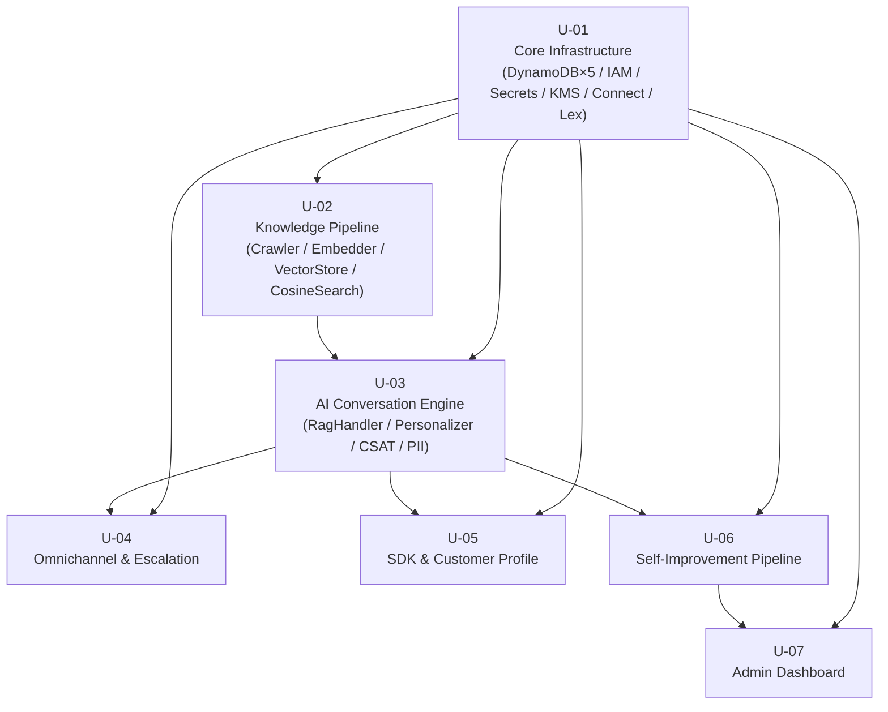

# Unit of Work 依存関係 — au Jibun Bank AI Agent

本ドキュメントは 7 ユニット（U-01〜U-07）間の依存関係を定義する。何に依存するか（DynamoDB テーブル、Lambda 呼び出し、共通モジュール、CDK Export）を明示し、デプロイ順序・共有リソース・共通モジュール利用状況を整理する。

- 関連: `unit-of-work.md`（ユニット定義）、`component-dependency.md`（コンポーネント依存・データモデル）、`component-methods.md`（メソッド・例外型）。

---

## 1. ユニット間依存グラフ（Mermaid）



---

## 2. 依存マトリクス（7×7）

行=依存元（このユニットが）、列=依存先（この列のユニットに依存する）。`●`=直接依存、`-`=依存なし、`／`=自分自身。

| 依存元 \ 依存先 | U-01 | U-02 | U-03 | U-04 | U-05 | U-06 | U-07 |
|---|:---:|:---:|:---:|:---:|:---:|:---:|:---:|
| **U-01** | ／ | - | - | - | - | - | - |
| **U-02** | ● | ／ | - | - | - | - | - |
| **U-03** | ● | ● | ／ | - | - | - | - |
| **U-04** | ● | - | ● | ／ | - | - | - |
| **U-05** | ● | - | ● | - | ／ | - | - |
| **U-06** | ● | - | ● | - | - | ／ | - |
| **U-07** | ● | - | - | - | - | ● | ／ |

> 全ユニットが U-01 に依存（基盤テーブル/IAM/KMS/Connect）。U-04/U-05/U-06 は U-03 に依存。U-07 は U-06 に依存（U-01 経由でテーブル参照、提案生成は U-06）。

---

## 3. 各依存関係の詳細

| 依存元 → 依存先 | 依存種別 | 依存内容 |
|---|---|---|
| U-02 → U-01 | DynamoDB / IAM / KMS / S3 / EventBridge | `VectorStore` / `ContentDiff` テーブル、S3 バケット、KMS キー、最小権限ロール、EventBridge Scheduler 基盤。 |
| U-03 → U-01 | DynamoDB / Connect / Lex / IAM | `CustomerHistory` テーブル（TTL 90日）、Connect インスタンス ARN、Lex ボット ID、Polly/Comprehend/Bedrock 権限。 |
| U-03 → U-02 | Lambda 内部呼び出し / 共有モジュール | `CosineSimilaritySearcher.search()`（コサイン検索 + `/tmp` キャッシュ）、`VectorStore.scan_all()`、ベクトル検索結果（`SearchHit`）。RAG 検索のナレッジ基盤。 |
| U-04 → U-01 | DynamoDB / Connect | `CustomerHistory`（文脈引き継ぎ）、Connect チャネル設定・キュー・発信フロー。 |
| U-04 → U-03 | Lambda / データ | RAG の `hit` 判定（エスカレーション契機）、CSAT フロー（US-1.4）への復帰ルーティング、`HistoryRepository` のターンデータ。 |
| U-05 → U-01 | DynamoDB / Secrets | `CustomerHistory`（プロファイル参照）、Secrets Manager（CRM API キー）、SQS DLQ。 |
| U-05 → U-03 | データ | 会話サマリー（US-6.1 生成）を CRM へ書き込み（US-6.3）。`customerId` 解決後のプロファイル注入は U-03 が消費。 |
| U-06 → U-01 | DynamoDB / EventBridge / Bedrock | `ContactAnalysis` / `ImprovementSuggestions` / `CustomerHistory` テーブル、EventBridge Scheduler、Bedrock 権限、Contact Lens。 |
| U-06 → U-03 | データ | PII マスク済み会話サマリー（U-03 の `PiiMasker` 出力）を Claude ギャップ分析の入力に使用。CSAT/エスカレーションフラグ（U-03/U-04 由来）。 |
| U-07 → U-01 | DynamoDB / Cognito / API GW | `ImprovementSuggestions`（一覧/更新）、`CustomerHistory` / `ContactAnalysis`（集計）、Cognito ユーザープール、API Gateway。 |
| U-07 → U-06 | データ | U-06 が生成した `ImprovementSuggestions` レコード（提案一覧・承認対象）。 |
| 全 → U-01（共通） | 共通モジュール `src/common/` | `AppError` 例外階層（全ユニット）。`BedrockClient` / `PiiMasker` は U-02/U-03/U-06 が利用。 |

---

## 4. CDK スタック依存（デプロイ順序）

CloudFormation Export / SSM パラメータ経由でクロススタック参照する。デプロイは依存順で実施。

```
1. SharedInfraStack       (U-01)  ← 全 Export の供給元
2. KnowledgePipelineStack (U-02)  ← U-01
3. ConversationStack      (U-03)  ← U-01, U-02
4. OmnichannelStack       (U-04)  ← U-01, U-03
5. ProfileStack           (U-05)  ← U-01, U-03   （U-04 と並列デプロイ可）
6. ImprovementStack       (U-06)  ← U-01, U-03
7. DashboardStack         (U-07)  ← U-01, U-06
```

| スタック | 参照する Export（U-01 由来が中心） |
|---|---|
| KnowledgePipelineStack | VectorStore/ContentDiff テーブル名・ARN、S3 バケット名、KMS Key ARN、ロール ARN |
| ConversationStack | CustomerHistory テーブル名・GSI、Connect インスタンス ARN、Lex ボット ID、（U-02）VectorStore 参照 |
| OmnichannelStack | Connect インスタンス ARN、キュー、CustomerHistory、（U-03）RagHandler/CSAT フロー ARN |
| ProfileStack | CustomerHistory、CRM Secret ARN、DLQ |
| ImprovementStack | ContactAnalysis/ImprovementSuggestions/CustomerHistory、EventBridge、Contact Lens 設定 |
| DashboardStack | ImprovementSuggestions、ContactAnalysis、CustomerHistory、Cognito、API Gateway |

> 削除順は逆順（U-07 → U-01）。クロススタック Export は削除依存を生むため、`cdk destroy` も依存順を遵守する。

---

## 5. 共有リソース一覧（DynamoDB テーブル 読み書きマトリクス）

`W`=書き込み（upsert/put/update/delete）、`R`=読み取り（get/query/scan）、`C`=作成（CDK 定義）、空欄=アクセスなし。

| テーブル | U-01 | U-02 | U-03 | U-04 | U-05 | U-06 | U-07 |
|---|:---:|:---:|:---:|:---:|:---:|:---:|:---:|
| **VectorStore** | C | R/W | R | | | | |
| **CustomerHistory** | C | | R/W | R/W | R | R | R |
| **ImprovementSuggestions** | C | | | | | R/W | R/W |
| **ContentDiff** | C | R/W | | | | | |
| **ContactAnalysis** | C | | | | | R/W | R |

補足:
- **VectorStore**: U-02 が upsert/delete/scan、U-03 が RAG クエリ時に検索（実体は U-02 の `CosineSimilaritySearcher` 経由）。
- **CustomerHistory**: 共有度が最も高い。U-03 が書き込み主体（履歴追記・サマリー）、U-04（文脈引き継ぎ）/ U-05（プロファイル参照・CRM 連携）/ U-06（分析）/ U-07（集計）が読み取り。GSI `gsi_contactId` を U-04/U-06 が利用。
- **ImprovementSuggestions**: U-06 が生成、U-07 がステータス更新（R/W 双方）。
- **ContentDiff**: U-02 専用（差分検出）。
- **ContactAnalysis**: U-06 が生成、U-07 が集計参照。

---

## 6. 共通モジュール（`src/common/`）利用ユニット一覧

| 共通モジュール | 定義 | 利用ユニット | 用途 |
|---|---|---|---|
| `AppError`（例外階層） | U-01（基底定義） | U-01〜U-07（全ユニット） | 全 Lambda の例外捕捉・構造化 JSON ログ（PII 除外）。`DynamoAccessError` / `BedrockError` / `TimeoutBudgetExceeded` など全派生型。 |
| `BedrockClient` | U-02/U-03（実装拡充） | U-02（`embed`）, U-03（`generate_answer` / `embed`）, U-06（`analyze_gap`） | Claude claude-sonnet-4-6 回答生成・Titan v2 埋め込み・ギャップ分析。`BedrockThrottledError` 指数バックオフ。 |
| `PiiMasker` | U-03 | U-03（マスク本体）, U-06（マスク済みサマリー消費） | Comprehend による PII 検出/マスク。U-06 はマスク済み出力のみ使用。 |

> `BedrockClient` / `PiiMasker` は `src/common/` 配置だが、初回実装は利用開始ユニット（U-02/U-03）で行い、後続ユニットは参照のみ。`AppError` のみ U-01 で先行定義する。
